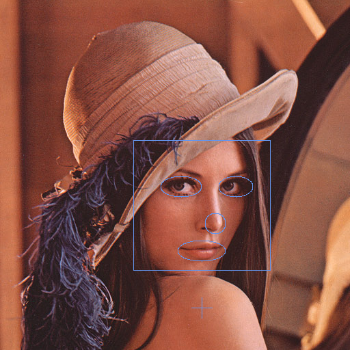

# Computer Vision
[](https://travis-ci.org/joemccann/dillinger) [](https://www.gnu.org/licenses/gpl-3.0)

## Overview
 - This repository contains image operation implementations. For more detail please check the [Features](#Features) section.

## Installation
 - You can clone this repo with following command.
```sh
$ git clone https://github.com/Kadiryanik/ComputerVision
```

## Compile & Run
```sh
$ cd ComputerVision/
$ make # for compile
$ ./test -h # for printing usage
```

## Features
 - Converting rgb image to grayscale form
 - Converting rgb/grayscale image to binary form
 - Plot histogram (with python) while converting to binary form
 - [Drawing](#Drawing) shapes into image
 - Cropping image
 - Applying mask into image
 - Applying [morphologhy](#Morphology) into image (dilation|erosion|open|close)
 - [Identifying regions](#Identifying-Regions) on image

### Drawing
 - Drawing some shapes.
```sh
$ ./test -i images/backup/rgb-lena.bmp -d draws/face.txt
```

Input | Output
:--:|:--:
  |  

### Morphology
 - Applying morphology **open**.
```sh
$ ./test -i images/backup/numbers/number-w-noise-01.bmp -M open
```

Input | Output
:--:|:--:
  |  

---
### Identifying Regions
 - Calculating (learning) the features.
```sh
$ ./test -f learn -i db/numbers-class-image-db.txt -o db/my-numbers-features-db.txt
```
 - Testing mixed photo with calculated features.
```sh
$ ./test -f test -i db/my-numbers-features-db.txt -T images/backup/numbers/number-w-noise-01.bmp
```
 - Please download output image to view in high resolution.

Input | Output
:--:|:--:
  |  

## TODO
 - Add zoom in/out support
 - Add **jpeg** support
 - Add **png** support
 - Add real photos for test identification feature
 - Add user defined colors support with formatted input files
 - Add Color-Class relation into image corner
 - Add match percentage into region corner

## Maintainer
 - **Kadir Yanık** - _kdrynkk@gmail.com_

**Free Software, Hell Yeah!**
